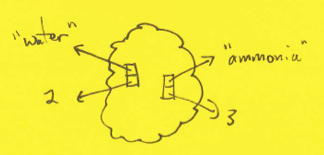

1.  [Sets](#s:sets)
2.  [Storage](#s:storage)
3.  [Dictionaries](#s:dict)
4.  [Simple Examples](#s:examples)
5.  [Nanotech Inventory](#s:nanotech)
6.  [Phylogenetic Trees](#s:phylotree)
7.  [Summing Up](#s:summary)

Fan Fullerene has just joined Molecules'R'Us, a nanotechnology startup
that fabricates molecules using only the highest quality atoms. His
first job is to build a simple inventory management system that compares
incoming orders for molecules to the stock of atoms in the company's
supercooled warehouse to see how many of those molecules we can build.
For example, if the warehouse holds 20 hydrogen atoms, 5 oxygen atoms,
and 11 nitrogen atoms, Fan could make 10 water molecules (H~2~O) or 6
ammonia molecules (NH~3~), but could not make any methane (CH~4~)
because there isn't any carbon.

Fan could solve this problem using the tools we've seen so far. As we'll
see, though, it's a lot more efficient to do it using a different data
structure. And "efficient" means both "takes less programmer time to
create" and "takes less computer time to execute": the data structures
introduced in this chapter are both simpler to use and faster than the
lists most programmers are introduced to first.

Sets
----

### Understand:

-   That lists and arrays are not the only data structures available to
    programmers.
-   That a set stores unique values.
-   How to perform common operations on sets.
-   How to use a set to eliminate duplicate values from data.

Let's start with something simpler than our actual inventory problem.
Suppose we have a list of all the atoms in the warehouse, and we want to
know which different kinds we have—not how many, but just their types.
We could solve this problem using a list to store the unique atomic
symbols we have seen as shown in [Figure XXX](#f:list_of_atoms).

Here's a function to add a new atom to the list:

    def another_atom(seen, atom):
        for i in range(len(seen)):
            if seen[i] == atom:
                return # atom is already present, so do not re-add
        seen.append(atom)

`another_atom`'s arguments are a list of the unique atoms we've already
seen, and the symbol of the atom we're adding. Inside the function, we
loop over the atoms that are already in the list. If we find the one
we're trying to add, we exit the function immediately: we aren't
supposed to have duplicates in our list, so there's nothing to add. If
we reach the end of the list without finding this symbol, though, we
append it. This is a common [design
pattern](glossary.html#design-pattern): either we find pre-existing data
in a loop and return right away, or take some default action if we
finish the loop without finding a match.

Let's watch this function in action. We start with an empty list. If the
first atomic symbol is `'Na'`, we find no match (since the list is
empty), so we add it. The next symbol is `'Fe'`; it doesn't match
`'Na'`, so we add it as well. Our third symbol is `'Na'` again. It
matches the first entry in the list, so we exit the function
immediately.

  --------- ----------------
  *start*   `[]`
  `'Na`     `['Na']`
  `'Fe'`    `['Na', 'Fe']`
  `'Na'`    `['Na', 'Fe']`
  --------- ----------------

This code works, but it is inefficient. Suppose there are *V* distinct
atomic symbols in our data, and *N* symbols in total. Each time we add
an observation to our list, we have to look through an average of *V/2*
entries. The total running time for our program is therefore
approximately *NV/2*. If *V* is small, this is only a few times larger
than *N*, but what happens if we're keeping track of something like
patient records rather than atoms? In that case, most values are
distinct, so *V* is approximately the same as *N*, which means that our
running time is proportional to *N^2^/2*. That's bad news: if we double
the size of our data set, our program runs four times slower, and if we
double it again, our program will have slowed down by a factor of 16.

There's a better way to solve this problem that is simpler to use and
runs much faster. The trick is to use a [set](glossary.html#set) to
store the symbols. A set is an unordered collection of distinct items.
The word "collection" means that a set can hold zero or more values. The
word "distinct" means that any particular value is either in the set or
not: a set can't store two or more copies of the same thing. And
finally, "unordered" means that values are simply "in" the set. They're
not in any particular order, and there's no first value or last value.
(They actually are stored in some order, but as we'll discuss in [the
next section](#s:storage), that order is as random as the computer can
make it.)

To create a set, we simply write down its elements inside curly braces
as we would in a math class:

    >>> primes = {3, 5, 7}

However, we have to use `set()` to create an empty set, because the
symbol `{}` was already being used for something else when sets were
added to Python:

    >>> even_primes = set() # not '{}' as in math

We'll meet that "something else" [later in this chapter](#s:dict).

To see what we can do with sets, let's create three holding the integers
0 through 9, the first half of that same range of numbers (0 through 4),
and the odd values 1, 3, 5, 7, and 9:

    >>> ten  = {0, 1, 2, 3, 4, 5, 6, 7, 8, 9}
    >>> lows = {0, 1, 2, 3, 4}
    >>> odds = {1, 3, 5, 7, 9}

If we ask Python to display one of our sets, it shows us this:

    >>> print lows
    set([0, 1, 2, 3, 4])

rather than using the curly-bracket notation. I personally regard this
as a design flaw, but it does remind us that we can create always create
a set from a list.

Sets have methods just like strings and lists, and, like the methods of
strings and lists, most of those methods create new sets instead of
modifying the set they are called for. These three come straight from
mathematics:

    >>> print lows.union(odds)
    set([0, 1, 2, 3, 4, 5, 7, 9])
    >>> print lows.intersection(odds)
    set([1, 3])
    >>> print lows.difference(odds)
    set([0, 2, 4])

Another method that creates a new set is `symmetric_difference`, which
is sometimes called "exclusive or":

    >>> print lows.symmetric_difference(odds)
    set([0, 2, 4, 5, 7, 9])

It returns the values that are in one set or another, but not in both.

Not all set methods return new sets. For example, `issubset` returns
`True` or `False` depending on whether all the elements in one set are
present in another:

    >>> print lows.issubset(ten)
    True

A complementary method called `issuperset` also exists, and does the
obvious thing:

    >>> print lows.issuperset(odds)
    False

We can count how many values are in a set using `len` (just as we would
to find the length of a list or string), and check whether a particular
value is in the set or not using `in`:

    >>> print len(odds)
    7
    >>> print 6 in odds
    False

Finally, some methods modify the sets they are called for. The most
commonly used is `add`, which adds an element to the set:

    >>> lows.add(9)
    >>> print lows
    set([0, 1, 2, 3, 4, 9])

If the thing being added is already in the set, `add` has no effect,
because any specific thing can appear in a set at most once:

    >>> lows.add(9)
    >>> print lows
    set([0, 1, 2, 3, 4, 9])

We can also clear the set:

    >>> lows.clear()
    >>> print lows
    set()

or remove individual elements:

    >>> lows.remove(0)
    >>> print lows
    set([1, 2, 3, 4])

Removing elements is similar to deleting things from a list, but there's
an important difference. When we delete something from a list, we
specify its *location*. When we delete something from a set, though, we
must specify the *value* that we want to take out, because sets are not
ordered. If that value isn't in the set, `remove` does nothing.

To help make programs easier to type and read, most of the methods we've
just seen can be written using arithmetic operators as well. For
example, instead of `lows.issubset(ten)`, we can write `lows <= ten`,
just as if we were using pen and paper. There are even a couple of
operators, like the strict subset test `<`, that don't have long-winded
equivalents.

  ------------------- ----------------------------------- ----------------
  *difference*        `lows.difference(odds)`             `lows - odds`
  *intersection*      `lows.intersection(odds)`           `lows & odds`
  *subset*            `lows.issubset(ten)`                `lows <= ten`
  *strict subset*                                         `lows < ten`
  *superset*          `lows.issuperset(ten)`              `lows >= odds`
  *strict superset*                                       `lows >= odds`
  *exclusive or*      `lows.symmetric_difference(odds)`   `lows ^ odds`
  *union*             `lows.union(odds)`                  `lows | odds`
  ------------------- ----------------------------------- ----------------

### Negation

One operator that *isn't* in this list is "not". Mathematicians are
quite comfortable negating sets: for example, the negation of the set
{1, 2} is all numbers that aren't 1 or 2. This is a lot harder to do in
a program, though. To continue with our example, we'd expect the integer
3 to be in the negation of the set `{1, 2}`, but is 107.7382? Or the
string "pterodactyl"?

The fact that the values in a set are distinct makes them a convenient
way to get rid of duplicate values, like the "unique atoms" problem at
the start of this section. Suppose we have a file containing the names
of all the atoms in our warehouse, and our task is to produce a list of
the their types. Here's how simple that code is:

~~~~ {src="setdict/unique_atoms.py"}
import sys

filename = sys.argv[1]
source = open(filename, 'r')
atoms = set()
for line in source:
    name = line.strip()
    atoms.add(name)
print atoms
~~~~

We start by opening the file and creating an empty set which we will
fill with atomic symbols. As we read the lines in the file, we strip off
any whitespace (such as the newline character at the end of the line)
and put the resulting strings in the set. When we're done, we print the
set. Here are a couple of simple tests:

**file contents**

**result**

`             Fl           `

`             set(['Fl'])           `

* * * * *

Na\
Fe\
Na

set(['Na', 'Fe'])

The answers are correct, but the display might be a bit confusing: what
are those extra square brackets for? The answer is that if we want to
construct a set with values using `set()`, we have to pass those values
in a single object, such as a list. This syntax:

    set('Na', 'Fe', 'Fl')

does *not* work, even though it seems more natural. On the other hand,
this means that we can construct a set from almost anything that a `for`
loop can iterate over:

    >>> set('lithium')
    set(['i', 'h', 'm', 'l', 'u', 't'])

But hang on: if we're adding characters to the set in the order `'l'`,
`'i'`, `'t'`, `'h'`, `'i'`, `'u'`, `'m'`, why does Python show them in
the order `'i'`, `'h'`, `'m'`, `'l'`, `'u'`, `'t'`? To answer that
question, we need to look at how sets are actually stored, and why
they're stored that way.

### Summary

-   Use sets to store distinct unique values.
-   Create sets using `set()` or `{v1, v2, ...}`.
-   Sets are mutable, i.e., they can be updated in place like lists.
-   A loop over a set produces each element once, in arbitrary order.
-   Use sets to find unique things.

Storage
-------

### Understand:

-   How a hash table stores data.
-   The problems that can arise if mutable values are stored in a hash
    table.
-   How to store multi-part values in a hash table.

Let's create a set, add the string `'lithium'` to it (as a single item,
not character by character), and print the result:

    >>> things = set()
    >>> things.add('lithium')
    >>> print things
    set(['lithium'])

As expected, the string is in the set. Now let's try adding a list to
the same set:

    >>> things.add([1, 2, 3])
    TypeError: unhashable type: 'list'

Why doesn't that work? And what does that word "unhashable" mean?

When we create a set, the computer allocates a block of memory to store
references to the set's elements. When we add something to the set, or
try to look something up, the computer uses a [hash
function](glossary.html#hash-function) to figure out where to look. A
hash function is any function that produces a seemingly-random number
when given some data as input. For example, one way to hash a string is
to add up the numerical values of its characters. If the string is
"zebra", those values are 97 for lower-case 'a', 98 for lower-case 'b',
and so on up to 122 for lower-case 'z'. When we add them up, we will
always get the same result. We can use that result to figure out where
to store a reference to our string in the memory set aside for our hash
table ([Figure XXX](#f:set_storage)).

Now let's take a look at how a list would be stored. If the list
contains the same five characters, it will be stored in memory like
this:

Using addition as our hash function once again, we would get a hash
value of 532 for the list, so we would store it in the set's memory like
this:

But what happens if we change the characters in the list after we've
added it to the set? For example, suppose that we change the first
letter in the list from 'z' to 's'. The hash function's value is now 523
instead of 532, which means that the modified list belongs in a
different place in the set. However, the reference to the list is still
in the old location: the set doesn't know that the list's contents have
changed, so it hasn't moved its reference to the right location:

This is bad news. If we now ask, "Is the list containing 's', 'e', 'b',
'r', and 'a' in the set?" the answer will be "no", because the reference
to the list isn't stored in the location that our hash function tells us
to look. It's as if someone changed their name from "Tom Riddle" to
"Lord Voldemort", but we left all the personnel records filed under 'R'.

This problem arises with any [mutable](glossary.html#mutable)
structure—i.e., any structure whose contents or value can be changed
after its creation. Integers and strings are safe to hash because their
values are fixed, but the whole point of lists is that we can grow them,
shrink them, and overwrite their contents.

Different languages and libraries handle this problem in different ways.
One option is to have each list keep track of the sets that it is in,
and move itself whenever its values change. However, this is expensive:
every time a program touched a list, it would have to see if it was in
any sets, and if it was, recalculate its hash code and update all the
references to it.

A second option is to shrug and say, "It's the programmer's fault." This
is what most languages do, but it's also expensive: programmers can
spend hours tracking down the bugs that arise from data being in the
wrong place.

Python uses a third option: it only allows programmers to put
[immutable](glossary.html#immutable) values in sets. After all, if
something's value can't change, neither can its hash code or its
location in a hash table.

But if sets can only hold immutable values, what do we do with mutable
ones? In particular, how should we store things like (x,y) coordinates,
which are naturally represented as lists, or people's names, which are
naturally represented as lists of first, middle, and last names? Again,
there are several options.

The first is to concatenate those values somehow. For example, if we
want to store "Charles" and "Darwin", we'd create the string "Charles
Darwin" and store that. This is simple to do, but our code will wind up
being littered with string joins and string splits, which will make it
slower to run and harder to read. More importantly, it's oly safe to do
if we can find a concatenator that can never come up in our data. (If we
join "Paul Antoine" and "St. Cyr" using a space, there would be three
possible ways to split it apart again.)

The second option—the right one—is to use [tuples](glossary.html#tuple)
instead of lists. A tuple is an immutable list, i.e., a sequence of
values that cannot be changed after its creation. Tuples are created
exactly like lists, except we use parentheses instead of square
brackets:

    >>> full_name = ('Charles', 'Darwin')

They are indexed the same way, too, and functions like `len` do exactly
what we'd expect:

    >>> print full_name[0]
    Charles
    >>> len(full_name)
    2

What we *cannot* do is assign a new value to a tuple element, i.e.,
change the tuple after it has been created:

    >>> full_name[0] = 'Erasmus'
    TypeError: 'tuple' object does not support item assignment

This means that a tuple's hash code never changes, and *that* means that
tuples can be put in sets:

    >>> names = set()
    >>> names.add(('Charles', 'Darwin'))
    >>> print names
    set([('Charles', 'Darwin')])

### Summary

-   Sets are stored in hash tables, which guarantee fast access for
    arbitrary keys.
-   The values in sets must be immutable to prevent hash tables
    misplacing them.
-   Use tuples to store multi-part elements in sets.

Dictionaries
------------

### Understand:

-   That a dictionary stores key-value pairs in a hash table.
-   That dictionaries allow things to be looked up by value.
-   That the keys in a dictionary must be unique.
-   That a dictionary's keys must be immutable.
-   How to perform common operations on dictionaries.
-   Why dictionaries are intrinsically more efficient than lists for
    some applications.

Now that we know how to find out what kinds of atoms are in our
inventory, we want to find out how many of each we have. Our input is a
list of several thousand atomic symbols, and the output we want is a
list of names and counts.

The right way to solve this problem is to use a
[dictionary](glossary.html#dictionary) to store our data. A dictionary
is a unordered collection of key-value pairs ([Fixture
XXX](#f:simple_dict)). Like the elements in a set, keys are immutable,
unique, and not stored in any particular order. There are no
restrictions on the values stored with those keys: in particular, they
don't have to be immutable or unique.

We can create a new dictionary by putting key-value pairs inside curly
braces, using a colon to connect each pair. For example, let's create a
dictionary with two entries and assign it to the variable `birthdays`:

    >>> birthdays = {'Newton' : 1642, 'Darwin' : 1809}

The dictionary's keys are the strings `'Newton'` and `'Darwin'`. The
value associated with `'Newton'` is 1642, while the value associated
with `'Darwin'` is 1809. We can get the value associated with a key by
putting the key in square brackets:

    >>> print birthdays['Newton']
    1642

This looks just like subscripting a string or list, except dictionary
keys don't have to be integers—they can be strings, tuples, and so on.
It's just like using a phonebook or a real dictionary: instead of
looking things up by location using an integer index, we look things up
by name.

If we want to add another key-value pair to a dictionary, all we have to
do is assign a value to the key:

    >>> birthdays['Turing'] = 1612
    >>> print birthdays
    {'Turing' : 1612, 'Newton' : 1642, 'Darwin' : 1809}

If the key is already in the dictionary, assignment replaces the value
associated with it rather than adding another entry (since each key can
appear at most once). Let's fix Turing's birthday by replacing 1612 with
1912:

    >>> birthdays['Turing'] = 1912
    >>> print birthdays
    {'Turing' : 1912, 'Newton' : 1642, 'Darwin' : 1809}

Trying to get the value associated with a key that *isn't* in the
dictionary is an error, just like trying to get the fifth element of a
three-element list. For example, let's try to find Florence
Nightingale's birthday:

    >>> print birthdays['Nightingale']
    KeyError: 'Nightingale'

If we're not sure whether a key is in a dictionary or not, we can test
for it using `in`:

    >>> print 'Nightingale' in birthdays
    False
    >>> print 'Darwin' in birthdays
    True

Finally, we can see how many entries are in the dictionary using `len`:

    >>> print len(birthdays)
    3

and loop over the keys in a dictionary using `for`:

    >>> for name in birthdays:
    ...     print name, birthdays[name]
    ...
    Turing 1912
    Newton 1642
    Darwin 1809

This is a little bit different from looping over a list. When we loop
over a list, the loop gives us the values, since the "keys" 0, 1, 2, and
so on usually aren't particularly informative. When we loop over a
dictionary, on the other hand, the loop gives us the keys, which we can
use to look up the values.

Now, let's go back and count those atoms. The main body of our program
looks like this:

~~~~ {src="setdict/count_atoms.py"}
import sys

if __name__ == '__main__':
    reader = open(sys.argv[1], 'r')
    lines = reader.readlines()
    reader.close()
    count = count_atoms(lines)
    for atom in count:
        print atom, count[atom]
~~~~

The first three lines read the input file into a list of strings. We
then call a function `count_atoms` to turn that list into a dictionary
of atomic symbols and counts. Once we have that dictionary, we use a
loop like the one we just saw to print out its contents.

Here's the function that does the counting:

~~~~ {src="setdict/count_atoms.py"}
def count_atoms(lines):
  '''Count unique lines of text, returning dictionary.'''

    result = {}
    for atom in lines:
        atom = atom.strip()
        if atom not in result:
            result[atom] = 1
        else:
            result[atom] = result[atom] + 1

    return result
~~~~

We start with a docstring to explain the function's purpose to whoever
has to read it next. We then create an empty dictionary to fill with
data, and use a loop to process the lines from the input file one by
one.

After stripping whitespace off the atom's symbol, we check to see if
we've seen it before. If we haven't, we set its count to 1, because
we've now seen that atom one time. If we *have* seen it before, we add
one to the previous count and store that new value back in the
dictionary. Finally, when the loop is done, we return the dictionary
we've created.

Let's watch this function in action. Before we read any data, our
dictionary is empty. After we see `'Na'` for the first time, our
dictionary has one entry: its key is `'Na'`, and its value is 1. When we
see `'Fe'`, we add another entry to the dictionary with that string as a
key and 1 as a value. Finally, when we see `'Na'` for the second time,
we add one to its count.

  --------- ------------------------
  *start*   `{}`
  `Na`      `{'Na' : 1}`
  `Fe`      `{'Na' : 1, 'Fe' : 1}`
  `Na`      `{'Na' : 2, 'Fe' : 1}`
  --------- ------------------------

We could achieve the same thing using a list of lists, where each
sub-list is a `[symbol, count]` pair. But just like sets, dictionaries
are stored using hash tables, which guarantee that finding or modifying
values takes roughly constant time. This is a lot better than the
list-based method, where the time grows in proportion to the number of
pairs in the list.

Suppose, for example, that we have 100,000 atoms in our inventory of 50
different kinds. If the file is randomly ordered, we will soon have seen
every symbol at least once. After that, every new observation will
involve scanning approximately half of the list. The total number of
lookups required to build the list will therefore be 100,000 × 50/2, or
2.5 million.

If we use a dictionary, on the other hand, each lookup will take about
three times as long as looking at a single element of a list (because we
have to calculate a hash code). However, we never have to search the
dictionary: once we have the hash code, we can find the corresponding
entry in a single step. The total number of steps required to build the
dictionary will therefore be roughly 3 × 100,000, or 300,000. That is
more than eight times faster than the list-based implementation.

But now suppose that we have N patient records, and that each patient is
only seen once or twice. Using a pair-of-pairs approach, it will take
roughly N^2^ steps to build our data structure, but if we use a
dictionary, it will only takes 3 steps. If N is a million, that's quite
a savings.

Just as we use tuples for multi-part entries in sets, we can use them
for multi-part keys in dictionaries. For example, if we want to store
the years in which scientists were born using their full names, we could
do this:

    birthdays = {
        ('Isaac', 'Newton') : 1642,
        ('Charles', 'Robert', 'Darwin') : 1809,
        ('Alan', 'Mathison', 'Turing') : 1912
    }

If we do this, though, we have to look things up by the full key: there
is no way to ask for all the entries whose keys contain the word
`'Darwin'`. On the other hand, we *can* get all of the keys in a list:

    all_keys = birthdays.keys()
    print all_keys
    [('Isaac', 'Newton'), ('Alan', 'Mathison', 'Turing'), ('Charles', 'Robert', 'Darwin')]

The `keys` method should be used sparingly, since it actually creates a
new list in memory (the dictionary doesn't store the keys as a list
internally). In particular, we *shouldn't* loop over a dictionary's
entries like this:

    for key in some_dict.keys():
        ...do something with key and some_dict[key]

since "`for key in some_dict`" is shorter and much more efficient.

### Summary

-   Use dictionaries to store key-value pairs with distinct keys.
-   Create dictionaries using `{k1:v1, k2:v2, ...}`
-   Dictionaries are mutable, i.e., they can be updated in place.
-   Dictionary keys must be immutable, but values can be anything.
-   Use tuples to store multi-part keys in dictionaries.
-   `dict[key]` refers to the dictionary entry with a particular key.
-   `key in dict` tests whether a key is in a dictionary.
-   `len(dict)` returns the number of entries in a dictionary.
-   A loop over a dictionary produces each key once, in arbitrary order.
-   `dict.keys()` creates a list of the keys in a dictionary.
-   `dict.values()` creates a list of the keys in a dictionary.

Simple Examples
---------------

### Understand:

-   How to aggregate values using dictionaries.
-   Why actual data values should be used to initialize variables.

To see how useful dictionaries can be, let's switch tracks and do some
birdwatching. We'll start with the question, "How early in the day did
we see each kind of bird?" Our data consists of the date and time of the
observation, the bird's name, and an optional comment:

    2010-07-03    05:38    loon
    2010-07-03    06:02    goose
    2010-07-03    06:07    loon
    2010-07-04    05:09    ostrich   # hallucinating?
    2010-07-04    05:29    loon
         …           …        …

We want the minimum of all the times associated with each bird name, so
we'll use a dictionary with the bird name as the key and the earliest
observation time as the value.

First, let's read our data file and create a list of tuples, each of
stores has a date, time, and bird name as strings:

~~~~ {src="setdict/early_bird.py"}
def read_observations(filename):
    '''Read data, return [(date, time, bird)...].'''

    reader = open(filename, 'r')
    result = []

    for line in reader:
        fields = line.split('#')[0].strip().split()
        assert len(fields) == 3, 'Bad line "%s"' % line
        result.append(fields)

    return result
~~~~

This function follows the pattern we've seen many times before. We set
up by opening the input file and creating an empty list that we'll
append records to. We then process each line of the file in turn.
Splitting the line on the `'#'` character and taking the first part of
the result gets rid of any comment that might be present; stripping off
whitespace and then splitting breaks the remainder into fields. To
prevent trouble later on, we check that there actually are three fields
before going on. (An industrial-strength version of this function would
also check that the date and time were properly formatted, but we'll
skip that for now.) Once we've done our check, we append the triple
containing the date, time, and bird name to the list we're going to
return.

Here's the function that turns that list of tuples into a dictionary:

~~~~ {src="setdict/early_bird.py"}
def earliest_observation(data):
    '''How early did we see each bird?'''

    result = {}
    for (date, time, bird) in data:
        if bird not in result:
            result[bird] = time
        else:
            result[bird] = min(result[bird], time)

    return result
~~~~

Once again, the pattern should by now be familiar. We start by creating
an empty dictionary. Our loop handles one tuple at a time, splitting
that tuple into its component parts for use in the loop body. If this
bird's name is not already a key in our dictionary, this must be its
first appearance, so the time it was seen becomes the earliest
observation time. Otherwise, if there is already an entry for this bird
in the dictionary, we keep the minimum of the stored time and the new
time (instead of adding 1 to the count of observations as we did in the
previous example).

Now, what if we want to find out which birds were seen on each day that
we were observing? This is similar to the problem we just solved, so our
solution will have a similar structure. However, since we probably saw
more than one kind of bird each day, the values in our dictionary need
to be some sort of collection. And since we're only interested in which
birds we saw, we can use a set. Here's our function:

~~~~ {src="setdict/birds_by_date.py"}
def birds_by_date(data):
    '''Which birds were seen on each day?'''

    result = {}
    for (date, time, bird) in data:
        if date not in result:
            result[date] = {bird}
        else:
            result[date].add(bird)

    return result
~~~~

Again, we start by creating an empty dictionary, and process each record
in turn, unpacking it automatically in the loop header. Since we're
recording birds by date, the keys in our dictionary are dates rather
than bird names. If the current date isn't already a key in the
dictionary, we create a set containing only this bird, and store it in
the dictionary with the date as the key. Otherwise, we add this bird to
the set associated with the date. We don't need to check whether the
bird is already in that set, since the set will automatically eliminate
any duplication.

Let's watch this function in action. We start with an empty set, as
shown in [Figure XXX](#f:bird_date). After reading the first
observation, we add an entry to our dictionary with the string
`'2010-07-03'` as its key and an empty set as its value. We then
immediately add the name `'loon'` to that set.

Our next observation is a goose on the same day, so we put `'goose'` in
the set we just created. Our third observation is another loon. Since
adding a value to a set that's already present has no effect, our data
structure doesn't change. Next, though, we have the first observation
for July 4th. Since it's the first time we've seen this date, our
function adds a new entry to the main dictionary with `'2010-07-04'` as
the key and a set as the value, then adds `'ostrich'` to that set.
Finally, we have another damn loon, which goes into the second of our
sets, and we're done.

For our last example, we'll find which bird we saw least frequently.
Actually, we'll find which *birds*, since two or more may be tied for
the low score—forgetting that values may not be unique is a common
mistake in data crunching, and often a hard one to track down.

One way to solve this problem is to do two passes over our data. We'll
assume that we already have a dictionary of bird names and total
observation counts. To find the minimum value, we loop over all entries
in the dictionary:

    for bird in counts:
        if counts[bird] < least:
            least = counts[bird]

We then use another loop to build the set of bird names that share that
minimum value:

    result = set()
    for bird in counts:
        if counts[bird] == least:
            result.add(bird)

There's a flaw in this code, though: we have not initialized `least`.
It's not safe to set it to a "large" value, like 1000, because while
it's unlikely that we'll have seen every type of bird at least 1000
times, it's not impossible.

Another choice that *will* work is to initialize it to the largest
integer the computer can represent, which Python stores in `sys.maxint`.
While it's still possible that we'll have seen everything more often
than this (imagine, for example, that we were counting atoms instead of
counting birds), there's no way we could get those observations into our
program.

The right choice, though, is to initialize `least` from the data itself.
We'll start by setting it to the special value `None`, and then check
for this value inside our loop. If `least` is `None`, it means we
haven't processed any data yet, so we'll assign whatever value we're
looking at to `least`. After that, all the less-than comparisons will do
the right thing. The resulting code looks like this:

    least = None
    for bird in counts:
        if least is None:
            least = counts[bird]
        elif counts[bird] < least:
            least = counts[bird]

This is another common design pattern: if we don't know what range of
values our data might take on, we initialize variables with a "don't
know" marker (such as `None`), then replace those markers with actual
values as quickly as possible.

Now let's combine the two passes into one. We start by creating both
`least` and `result`, then loop over our dictionary of counts:

    least = None
    result = set()
    for bird in counts:
        num = counts[bird]
        …    …    …

In our loop, we have four cases to consider:

  ------------------- ---------------------------------------------------------------------------------------------
  `least` is `None`   This is the first record we have processed, so we need to re-set `least` and `result`.
  `num < least`       We have found a new minimum, so we need to re-set `least` and `result`.
  `num == least`      We have seen this bird the current least number of times, so we need to add it to `result`.
  `num > least`       We have seen this bird more than the least number of times, so we can ignore it.
  ------------------- ---------------------------------------------------------------------------------------------

Here's what that decision table looks like in code:

    least = None
    result = set()
    for bird in counts:
        num = counts[bird]
        if least is None:
            least = num
            result = {bird}
        elif num < least:
            least = num
            result = {bird}
        elif num == least:
            result.add(bird)
        else:
            # do nothing

We can simplify this a bit by combining the first two cases (since they
do the same thing) and getting rid of the last one (since it does
nothing):

    least = None
    result = set()
    for bird in counts:
        num = counts[bird]
        if (least is None) or (num < least):
            least = num
            result = {bird}
        elif num == least:
            result.add(bird)

Remember, `or` only evaluates its right side if it has to, so if `least`
is `None`, this code won't get an error by comparing `num` to `None`.

Let's watch this function run with an input dictionary containing three
entries. We initialize `number` to 0 and `result` to an empty set
([Figure XXX](#f:min_bird)). Processing the first entry in the
dictionary takes us into our three cases: `num` is assigned 3, and
`'loon'` is put in our set of birds. The second entry has a new minimum
count, so we replace both the value of `num` and our set. Finally, the
third bird's count is the same as the current minimum, so we just add it
to the set, and we're done.

### Summary

-   Use dictionaries to count things.
-   Initialize values from actual data instead of trying to guess what
    values could "never" occur.

Nanotech Inventory
------------------

### Understand:

-   That dictionaries can be nested like lists.

We can now build a solution to Fan's original nanotech inventory
problem. Our goal is to find out how many molecules of various kinds we
can make using the atoms in our warehouse. The number of molecules of
any particular type we can make is limited by the scarcest atom that
molecule requires. For example, if we have five nitrogen atoms and ten
hydrogen atoms, we can only make three ammonia molecules, because we
need three hydrogen atoms for each.

The formulas for the molecules we know how to make are stored in a file
like this:

    # Molecular formula file

    helium : He 1
    water : H 2 O 1
    hydrogen : H 2

and our inventory is stored in a file like this:

    # Atom inventory file

    He 1
    H 4
    O 3

Let's start with our inventory. Our input consists of pairs of strings
and numbers, which by now should suggest using a dictionary for storage.
The keys will be atomic symbols, and the values will be the number of
atoms of that kind we currently have in stock ([Figure
XXX](#f:nanotech_inventory)). If an atom isn't listed in our inventory,
we'll assume that we don't have any in stock.

What about the formulas for all the molecules we know how to make?
Again, the right answer is a dictionary: its keys will be the name of
molecules, and each value will be a dictionary storing atomic symbols
and the number of atoms of that type in the molecule—the same structure,
in fact, that we're using for our inventory. [Figure
XXX](#f:nanotech_formulas) shows an outer dictionary that maps the word
`'water'` to a dictionary storing the number of oxygen and hydrogen
atoms in a single water molecule, and the word `'ammonia'` to a
dictionary storing the number of nitrogen and hydrogen atoms in a single
ammonia molecule.

Finally, we'll store the results of our calculation in yet another
dictionary, this one mapping the names of molecules to how many
molecules of that kind we can make ([Figure XXX](#f:nanotech_results)):

The main body of the program is straightforward: it just reads in the
input files, does our calculation, and prints the result.

~~~~ {src="setdict/nanotech.py"}
'''Calculate how many molecules of each type can be made with the atoms on hand.'''

import sys

if __name__ == '__main__':
    inventory = read_inventory(sys.argv[1])
    formulas = read_formulas(sys.argv[2])
    counts = calculate_counts(inventory, formulas)
    show_counts(counts)
~~~~

Reading the inventory file is simple. We take each interesting line in
the file, split it to get an atomic symbol and a count, and store them
together in a dictionary:

~~~~ {src="setdict/nanotech.py"}
def read_inventory(filename):
    '''Read inventory of available atoms.'''

    result = {}
    for line in read_lines(filename):
        name, count = line.split(' ')
        result[name] = int(count)

    return result
~~~~

For clarity's sake, we have used a helper function called `read_lines`
to read a file and strip out blank lines and comments:

~~~~ {src="setdict/nanotech.py"}
def read_lines(filename):
    '''Read lines from file, stripping out blank lines and comments.'''

    reader = open(filename, 'r')
    lines = []
    for line in reader:
        line = line.split('#')[0].strip()
        if line:
            lines.append(line)
    reader.close()

    return lines
~~~~

Using that same function, the function that reads in a file of molecular
formulas is only slightly more complex than the one that reads in
inventory:

~~~~ {src="setdict/nanotech.py"}
def read_formulas(filename):
    '''Read molecular formulas from file.'''

    result = {}                                        # 1
    for line in read_lines(filename):

        name, atoms = line.split(':')                  # 2
        name = name.strip()

        atoms = atoms.strip().split(' ')               # 3
        formula = {}
        for i in range(0, len(atoms), 2):              # 4
            formula[atoms[i]] = int(atoms[i+1])        # 5

        result[name] = formula                         # 6

    return result                                      # 7
~~~~

We start by creating the dictionary we're going to store the results in
(\#1). For each line in the file that has some data, we split on the
colon ':' to separate the molecule's name (which may contain spaces)
from its formula (\#2). We then split the formulas into a list of
strings that alternate between atomic symbols and counts (\#3). In the
inner loop (\#4), we move forward through those values two elements at a
time, storing the atomic symbol and count in a dictionary (\#5). Once
we're done, we store that dictionary as the value for the molecule name
in the main dictionary (\#6). When we've processed all the lines, we
return the final result (\#7).

Now that we have all our data, it's time to calculate how many molecules
of each kind we can make. `inventory` maps atomic symbols to counts, and
so does `formulas[name]`, so let's loop over all the molecules in our
formulas and "divide" those two dictionaries using another helper
function:

~~~~ {src="setdict/nanotech.py"}
def calculate_counts(inventory, formulas):
    '''Calculate how many of each molecule can be made with inventory.'''

    counts = {}
    for name in formulas:
        counts[name] = dict_divide(inventory, formulas[name])

    return counts
~~~~

It might seem like overkill to write yet another function in this case,
but experience shows that if we have a choice between big functions in
which nothing is obviously wrong, or little functions in which obviously
nothing is wrong, we should choose the latter. Here's that helper
function:

~~~~ {src="setdict/nanotech.py"}
def dict_divide(inventory, molecule):
    '''Calculate how much of a single molecule can be made with inventory.'''

    number = None
    for atom in molecule:
        required = molecule[atom]
        available = inventory.get(atom, 0)
        limit = available / required
        if (number is None) or (limit < number):
            number = limit

    return number
~~~~

This function loops over all the atoms in the molecule we're trying to
build, see what limits the available inventory puts on us, and return
the minimum of all those results. This function uses a few patterns that
come up frequently in many kinds of programs, so let's have a closer
look.

The first pattern is to initialize the value we're going to return to
`None`, then test for that value inside the loop to make sure we re-set
it to a legal value the first time we have real data. In this case, we
could just as easily use -1 or some other impossible value as an
"uninitialized" flag for `number`.

Since we're looping over the keys of `molecule`, we know that we can get
the value stored in `molecule[atom]`. However, that atom might not be a
key in `inventory`, so we use `inventory.get(atom, 0)` to get either the
stored value or a sensible default. In this case zero, the sensible
default is 0, because if the atom's symbol isn't in the dictionary, we
don't have any of it. This is our second pattern.

The third is using calculate, test, and store to find a single value—in
this case, the minimum—from a set of calculated values. We could
calculate the list of available over required values, then find the
minimum of the list, but doing the minimum test as we go along saves us
having to store the list of intermediate values. It's probably not a
noticeable time saving in this case, but it would be with larger data
sets.

The last step in building our program is to show how many molecules of
each kind we can make. We could just loop over our result dictionary,
printing each molecule's name and the number of times we could make it,
but let's sort the results by molecule name to make things easier to
find:

~~~~ {src="setdict/nanotech.py"}
def show_counts(counts):
    '''Show how many of each kind of molecule we can make.'''

    names = counts.keys()
    names.sort()
    for name in names:
        print name, counts[name]
~~~~

It's time to test our code. Let's start by using an empty inventory and
a single formula:

Inventory

Formulas

Output

    # inventory-00.txt

    # formulas-01.txt
    helium : He 1

There's no output, which is what we expect. Let's add one atom of helium
to our inventory:

Inventory

Formulas

Output

    # inventory-01.txt
    He 1

    # formulas-01.txt
    helium : He 1

    helium 1

That seems right as well. Let's add some hydrogen, but don't give the
program any formulas that use hydrogen:

Inventory

Formulas

Output

    # inventory-02.txt
    He 1
    H 4

    # formulas-01.txt
    helium : He 1

    helium 1

The output doesn't change, which is correct. Let's try adding the
formula for water, which does use hydrogen, but not providing any
oxygen:

Inventory

Formulas

Output

    # inventory-02.txt
    He 1
    H 4

    # formulas-02.txt
    helium : He 1
    water: H 2 O 1

    helium 1

As we hoped, there's no water in the output, but helium is still
appearing as it should. Let's add the formula for molecular hydrogen:

Inventory

Formulas

Output

    # inventory-02.txt
    He 1
    H 4

    # formulas-03.txt
    helium : He 1
    water: H 2 O 1
    hydrogen: H 2

    helium 1
    hydrogen 2

Sure enough, we can make two molecules of hydrogen (each of which uses
two atoms). Finally, let's put some oxygen in the warehouse:

Inventory

Formulas

Output

    # inventory-03.txt
    He 1
    H 4
    O 3

    # formulas-03.txt
    helium : He 1
    water: H 2 O 1
    hydrogen: H 2

    helium 1
    hydrogen 2
    water 2

That's right too: we can make two water molecules (because we don't have
enough hydrogen to pair with our three oxygen atoms). There are quite a
few other interesting tests still to run, but things are looking good so
far.

Our code is a *lot* simpler than it would be if we used lists of pairs
of atom names and counts to store things. It's also a lot more
efficient, and (while it may not feel that way yet) much easier to read.

### Summary

-   Nested dicionaries are as useful as nested lists.
-   Use names as keys rather than matching them to arbitrary integer
    indices.

Phylogenetic Trees
------------------

### Understand:

-   That many "matrix" problems may be best solved using dictionaries.
-   Why the values in multi-part keys should be ordered somehow.

As Theodosius Dobzhansky said almost a century ago, nothing in biology
makes sense except in the light of evolution. Since mutations usually
occur one at a time, the more similarities there are between the DNA of
two species, the more recently they had a common ancestor. We can use
this idea to reconstruct the evolutionary tree for a group of organisms
using a hierarchical clustering algorithm.

We don't have to look at the natural world very hard to realize that
some organisms are more alike than others. For example, if we look at
the appearance, anatomy, and lifecycles of the seven fish shown in
[Figure XXX](#f:species_pairs), we can see that three pairs are closely
related. But where does the seventh fit in? And how do the pairs relate
to each other?

The first step is to find the two species that are most similar, and
construct their plausible common ancestor. We then pair two more, and
two more, and start joining pairs to individuals, or pairs with other
pairs. Eventually, all the organisms are connected. We can redraw those
connections as a tree, using the heights of branches to show the number
of differences between the species we're joining up ([Figure
XXX](#f:species_tree)).

Let's turn this into an algorithm:

    U = {all organisms}
    while U != {}:
      a, b = two closest entries in U
      p = common parent of {a, b}
      U = U - {a, b}
      U = U + {p}

Initially, our universe U contains all the organisms we're interested
in. While there are still organisms that haven't been connected to the
tree, we find the two that are closest, calculate their common parent,
remove the two we just paired up from the set, and insert the
newly-created parent. The set of ungrouped organisms shrinks by one each
time, so this algorithm eventually terminates. And we can keep track of
the pairings on the side to reconstruct the tree when we're done.

Now, what does "closest" mean? One rule is called *unweighted pair-group
method using arithmetic averages*, or UPGMA. Let's illustrate it by
calculating a phylogenetic tree for humans, vampires, werewolves, and
mermaids. The distances between each pair of species is shown in the
table below (we only show the lower triangle because it's symmetric):

  ---------- ------- --------- ---------- ---------
             human   vampire   werewolf   mermaid
  human                                    
  vampire    13                            
  werewolf   5       6                     
  mermaid    12      15        29          
  ---------- ------- --------- ---------- ---------

The closest entries—i.e., the pair with minimum distance—are human and
werewolf. We will replace this with a common ancestor, which we will
call HW. Its height will be 1/2 the value of the entry, and for each
other species X, we will calculate a new score for HW and X as (HX + WX
- HW)/2. For example, we will combine HV and VW (in yellow) and HM and
MW (in green):

  ---------- ------- --------- ---------- ---------
             human   vampire   werewolf   mermaid
  human                                    
  vampire    13                            
  werewolf   5       6                     
  mermaid    12      15        29          
  ---------- ------- --------- ---------- ---------

Our new matrix looks like this:

  --------- ---- --------- ---------
            HW   vampire   mermaid
  HW                        
  vampire   7               
  mermaid   18   15         
  --------- ---- --------- ---------

The height of HW is half of the 5 we eliminated, or 2.5 ([Figure
XXX](#f:phylo_combine_tree_1)). Repeating this step, we combine HW with
V:

  --------- ----- ---------
            HWV   mermaid
  HWV              
  mermaid   15     
  --------- ----- ---------

and finally HWV with M. Our final tree looks like [Figure
XXX](#f:phylo_combine_tree_2), with the "missing" heights are implied by
the differences between branch values.

We illustrated our algorithm with a triangular matrix, but the order of
the rows and columns is arbitrary. It's really just a lookup table
mapping pairs of organisms to numbers. And as soon as we think of lookup
tables, we should think of dictionaries. The keys are pairs of
organisms, which we will keep in alphabetical order so that there's no
confusion between 'HW' and 'WH'. The values are the distances between
those organisms, so this table:

  ---------- ------- --------- ---------- ---------
             human   vampire   werewolf   mermaid
  human                                    
  vampire    13                            
  werewolf   5       6                     
  mermaid    12      15        29          
  ---------- ------- --------- ---------- ---------

becomes this dictionary:

    {
        ('human',   'mermaid')  : 12,
        ('human',   'vampire')  : 13,
        ('human',   'werewolf') :  5,
        ('mermaid', 'vampire')  : 15,
        ('mermaid', 'werewolf') : 29,
        ('vampire', 'werewolf') :  6
    }

Let's write some code. To start, we'll translate the algorithm we
discussed earlier into something that looks like Python:

    while len(scores) > 0:
        min_pair = find_min_pair(species, scores)
        parent, height = create_new_parent(scores, min_pair)
        print parent, height
        old_score = remove_entries(species, scores, min_pair)
        update(species, scores, min_pair, parent, old_score)

The scores are in a dictionary called `scores`, and the names of the
species are in a list called `species`, which is sorted alphabetically.
While we have some scores left to process, we find the closest pair,
create a new parent, print it out, remove entries that refer to the pair
we're combining, and add new entries to the scores table. (In a complete
program, we'd save the parent and height somewhere so that we could
reconstruct the tree afterward.)

The next step is to write the functions our algorithm assumes. The first
is `min_pair`, which finds the closest pair of organisms in the scores
table:

~~~~ {src="setdict/phylogen.py"}
def find_min_pair(species, scores):
    '''Find minimum-value pair of species in scores.'''

    min_pair, min_val = None, None
    for pair in combos(species):

        assert pair in scores, 'Pair (%s, %s) not in scores' % pair
        if (min_val is None) or (scores[pair] < min_val):
            min_pair, min_val = pair, scores[pair]

    assert min_val is not None, 'No minimum value found in scores'
    return min_pair
~~~~

The algorithm is simple, but it assumes we have a way to generate all
valid combinations of organisms from the species list, so we'll need to
write that. It's also worth noting the `assert` statements that check
that the data we're working with is sensible and that we actually found
a minimum value. Remember, good programs fail early and fail often.

Now let's write the function that generates pairs of species. It uses a
double loop to construct a list of pairs:

~~~~ {src="setdict/phylogen.py"}
def combos(species):
    '''Generate all combinations of species.'''

    result = []
    for i in range(len(species)):
        for j in range(i+1, len(species)):
            result.append((species[i], species[j]))

    return result
~~~~

Notice the starting index on the inner loop: if the outer loop is at
position `i`, the inner loop starts at `i+1`, which ensures that each
possible pair is only generated once.

Notice also that every pair will always be alphabetically sorted,
because the overall list is sorted that way. This ensures that any two
names will always be paired in the same order, which is crucial to the
algorithm working correctly.

Looking back at the program's main body, the next function we need to
write is `create_new_parent`. It's pretty simple: we just concatenate
the names of the two organisms we're combining, and give that presumed
parental species a score that is half the score for the pair we're
combining. We'll put square brackets around the name to make it more
readable, and so that we can easily see the order in which things were
paired up:

~~~~ {src="setdict/phylogen.py"}
def create_new_parent(scores, pair):
    '''Create record for new parent.'''

    parent = '[%s %s]' % pair
    height = scores[pair] / 2.
    return parent, height
~~~~

Going back at our main program once again, we need to remove entries
from the scores table that refer to the organisms we're pairing up. We
also need to take their names out of the list of species. That's pretty
easy to do:

~~~~ {src="setdict/phylogen.py"}
def remove_entries(species, scores, pair):
    '''Remove species that have been combined.'''

    left, right = pair
    species.remove(left)
    species.remove(right)
    old_score = scores[pair]
    del scores[pair]
    return old_score
~~~~

Notice that this function returns the old score, which we need in the
main program. This isn't a great design: there's nothing in the name
`remove_entries` to suggest that we're saving and returning the old
score, and it isn't obvious why we're doing this when we're reading this
function. As an exercise, try rewriting the main program so that
`remove_entries` doesn't have to return anything, and see if you think
it's easier to understand.

Our fifth function updates the scores table and species list. It's the
most complicated of them all. For each species that *isn't* being paired
up, we have to:

1.  calculate the combination of that species with the two halves of the
    new pair, saving the scores for later use;
2.  create a pair that includes the newly-constructed parent; and
3.  save our work.

When we're done, we have to add the newly-created parent to the list of
species, and then re-sort that list (remember, our `combos` function
assumes that species' names appear in order). The whole thing looks like
this:

~~~~ {src="setdict/phylogen.py"}
def update(species, scores, pair, parent, parent_score):
    '''Replace two species from the scores table.'''

    left, right = pair
    for other in species:
        l_score = tidy_up(scores, left, other)
        r_score = tidy_up(scores, right, other)
        new_pair = make_pair(parent, other)
        new_score = (l_score + r_score - parent_score)/2.
        scores[new_pair] = new_score

    species.append(parent)
    species.sort()
~~~~

Again, this is not a very good design: it won't be clear to the next
person reading the function why the call to `species.sort` has to be
there. if it isn't clear why something is being done where it is, it
should be moved or explained. As an exercise, try to reorganize the code
to make the reasoning clearer.

Our program now has five functions and a main body. We're still not
done, though: we need to write the `tidy_up` function we referred to in
`update`. It in turn assumes a function called `make_pair` that combines
a pair of species, which simply constructs a tuple of the species' names
ordered alphabetically. Remember, we're ordering names so that each pair
has a unique representation. Our two new functions look like this:

~~~~ {src="setdict/phylogen.py"}
def tidy_up(scores, old, other):
    '''Clean out references to old species.'''
    pair = make_pair(old, other)
    score = scores[pair]
    del scores[pair]
    return score

def make_pair(left, right):
    '''Make an ordered pair of species.'''

    if left < right:
        return (left, right)
    else:
        return (right, left)
~~~~

We have nothing left to write, so let's try it out. If we run it with
the four species we used as an example earlier, the output is:

    $ python phylogen.py
    [human werewolf] 2.5
    [[human werewolf] vampire] 3.5
    [[[human werewolf] vampire] mermaid] 6.5

These are the same values we had in our example tree, so the program
might be right. As one last exercise, try making up two or three other
(simpler) test cases that will exercise the code we've written.

### Summary

-   Problems that are described using matrices can often be solved more
    efficiently using dictionaries.
-   When using tuples as multi-part dictionary keys, order the tuple
    entries to avoid accidental duplication.

Summing Up
----------

Every programmer meets lists (or arrays or matrices) early in her
career. Most never meet sets and dictionaries, and that's a shame: for
many problems, they're more efficient in both human and machine terms.
They're also the basis of some advanced programming techniques that give
us much more control over what our programs do and how they do it. To
see how, try this at an interactive Python prompt:

    >>> globals()
    {'__builtins__': <module '__builtin__' (built-in)>,
     '__doc__': None,
     '__name__': '__main__',
     '__package__': None}

That's right—Python actually stores the program's variables in a
dictionary. In fact, it uses several such dictionaries, one for the
global variables and one for each function that's currently being
called:

    >>> def example(first, second):
    ...     print 'globals in example', globals()
    ...     print 'locals in example', locals()
    ... 
    >>> example(22, 33)
    globals in example {'__builtins__': <module '__builtin__' (built-in)>,
                        '__doc__': None,
                        '__name__': '__main__',
                        '__package__': None,
                        'example': <function example at 0x50b630>}
    locals in example {'second': 33,
                       'first': 22}

You now know everything you need to know in order to build a programming
language of your own. But please don't: the world will be much better
off if you keep doing science instead.
