1.  [Basic Use](#s:basics)
2.  [Merging Conflicts](#s:merge)
3.  [Recovering Old Versions](#s:rollback)
4.  [Setting up a Repository](#s:setup)
5.  [Provenance](#s:provenance)
6.  [Summing Up](#s:summary)

Suppose that Wolfman and Dracula have been hired by Universal Monsters
Inc. to figure out where the company should put its next secret lair.
They want to be able to work on the plans at the same time, but they
have run into problems doing this in the past. If they take turns, each
one will spend a lot of time waiting for the other to finish. On the
other hand, if they work on their own copies and email changes back and
forth they know that things will be lost, overwritten, or duplicated.

The right solution is to use a [version control
system](glossary.html#version-control-system) to manage their work.
Version control is better than mailing files back and forth because:

1.  It's hard (but not impossible) to accidentally overlook or overwrite
    someone's changes, because the version control system highlights
    them automatically.
2.  There are no arguments about whose copy is the most up to date.
3.  Nothing that is committed to version control is ever lost. This
    means it can be used like the "undo" feature in an editor, and since
    all old versions of files are saved it's always possible to go back
    in time to see exactly who wrote what on a particular day, or what
    version of a program was used to generate a particular set of
    results.

Version control systems do have one important shortcoming. While it is
easy for them to find, display, and merge differences in text files,
images, MP3s, PDFs, or Microsoft Word or Excel files aren't stored as
text—they use specialized binary data formats. Most version control
systems don't know how to deal with these formats, so all they can say
is, "These files differ." The rest is up to you.

Even with this limitation, version control is one of the most important
concepts in this book. The rest of this chapter will explore how to use
Subversion, a popular open source version control system.

Basic Use
---------

### Understand:

-   Where version control stores information.
-   How to check out a working copy of a repository.
-   How to view the history of changes to a project.
-   Why working copies of different projects should not overlap.
-   How to add files to a project.
-   How to submit changes made locally to a project's master copy.
-   How to update a working copy to get changes made to the master.
-   How to check the status of a working copy.

A version control system keeps the master copy of a file in a
[repository](glossary.html#repository) located on a
[server](glossary.html#server)—a computer that is never used directly by
people, but only by their programs ([Figure XXX](#f:repository)). No-one
ever edits the master copy directly. Instead, Wolfman and Dracula each
have a [working copy](glossary.html#working-copy) on their own computer.
This lets them make whatever changes they want whenever they want.

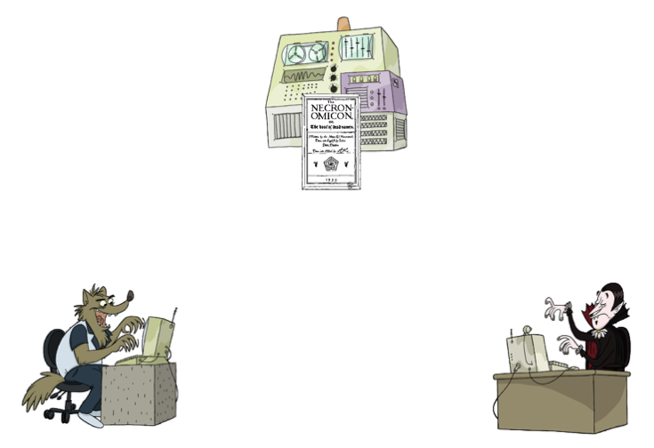

As soon Wolfman is ready to share his changes, he
[commits](glossary.html#commit) his work to the repository ([Figure
XXX](#f:workflow)). Dracula can then [update](glossary.html#update) his
working copy to get those changes. And of course, when Dracula finishes
working on something, he can commit and then Wolfman can update.

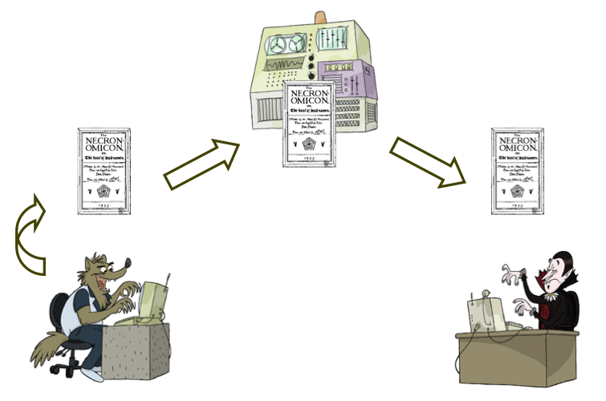

But what if Dracula and Wolfman make changes to the same part of their
working copies? Old-fashioned version control systems prevented this
from happening by [locking](glossary.html#lock) the master copy whenever
someone was working on it. This
[pessimistic](glossary.html#pessimistic-concurrency) strategy guaranteed
that a second person (or monster) could never make changes to the same
file at the same time, but it also meant that people had to take turns.

Most of today's version control systems use an
[optimistic](glossary.html#optimistic-concurrency) strategy instead.
Nothing is ever locked—everyone is always allowed to edit their working
copy. This means that people can make changes to the same part of the
paper, but that's actually fairly uncommon in a well-run project, and
when it *does* happen, the version control system helps people reconcile
their changes.

For example, if Wolfman and Dracula are making changes at the same time,
and Wolfman commits first, his changes are simply copied to the
repository ([Figure XXX](#f:merge_first_commit)):

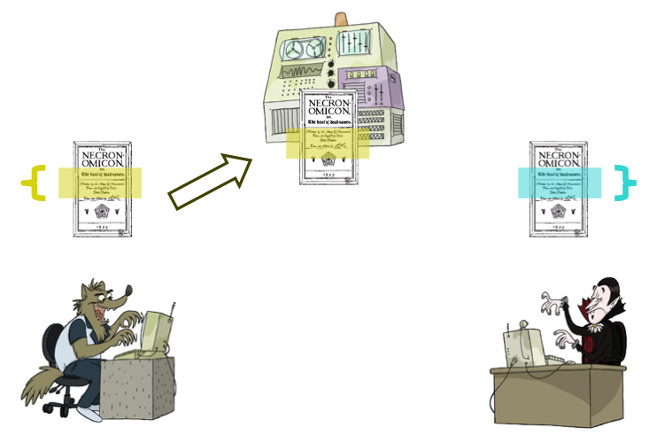

If Dracula now tries to commit something that would overwrite Wolfman's
changes the version control system stops him and points out the
[conflict](glossary.html#conflict) ([Figure
XXX](#f:merge_second_commit)):

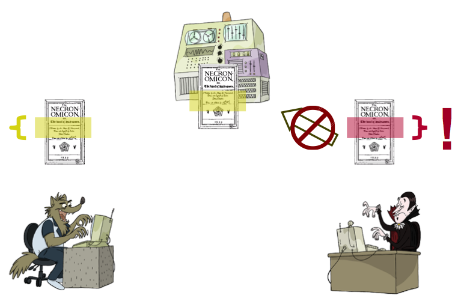

Dracula must [resolve](glossary.html#resolve) that conflict before the
version control system will allow him to commit his work. He can accept
what Wolfman did, replace it with what he has done, or write something
new that combines the two—that's up to him. Once he has fixed things, he
can go ahead and commit.

Let's start by looking at the basic workflow we use when working with a
version control system. To keep things simple, we'll assume that the
Mummy has already put some notes in a version control repository on the
`universal.software-carpentry.org` server. The full URL for this
repository is `https://universal.software-carpentry.org/monsters`. Every
repository has an address like this that uniquely identifies the
location of the master copy.

It's Monday night. In order to get a working copy on his computer,
Dracula has to [check out](glossary.html#check-out) a copy of the
repository. He only has to do this once per project: once he has a
working copy, he can update it over and over again to get other people's
work:

### There's More Than One Way To Do It

We will drive Subversion from the command line in our examples, but if
you prefer using a GUI, there are many for you to choose from:

-   [TortoiseSVN](http://tortoisesvn.net/) is integrated into the
    Windows desktop, so there's no separate GUI as such.
-   [RapidSVN](http://rapidsvn.tigris.org/) is free, and runs on many
    platforms, but some users report difficulties installing it.
-   Syntevo's [SmartSVN](http://www.syntevo.com/smartsvn/index.html)
    isn't free, but it costs less than most textbooks, and is more
    stable (and has a friendlier interface) than RapidSVN.

While in his home directory, Dracula types the command:

    $ svn checkout https://universal.software-carpentry.org/monsters

This creates a new directory called `monsters` and fills it with a copy
of the repository's contents ([Figure XXX](#f:example_repo)).

    A    monsters/jupiter
    A    monsters/mars
    A    monsters/mars/mons-olympus.txt
    A    monsters/mars/cydonia.txt
    A    monsters/earth
    A    monsters/earth/himalayas.txt
    A    monsters/earth/antarctica.txt
    A    monsters/earth/carlsbad.txt
    Checked out revision 6.

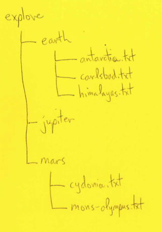

Dracula can then go into this directory and use regular shell commands
to view the files:

    $ cd monsters
    $ ls
    earth   jupiter mars
    $ ls *
    earth:
    antarctica.txt  carlsbad.txt  himalayas.txt

    jupiter:

    mars:
    cydonia.txt  mons-olympus.txt

### Don't Let the Working Copies Overlap

It's very important that the working copies of different project do not
overlap; in particular, we should never try to check out one project
inside a working copy of another project. The reason is that Subversion
stories information about the current state of a working copy in special
sub-directories called `.svn`:

    $ pwd
    /home/vlad/monsters
    $ ls -a
    .    ..    .svn    earth    jupiter    mars
    $ ls -F .svn
    entries    prop-base/    props/    text-base/    tmp/

If two working copies overlap, the files in the `.svn` directories for
one repository will be clobbered by the other repository's `.svn` files,
and Subversion will become hopelessly confused.

Dracula can find out more about the history of the project using
Subversion's `log` command:

    $ svn log
    ------------------------------------------------------------------------
    r6 | mummy | 2010-07-26 09:21:10 -0400 (Mon, 26 Jul 2010) | 1 line

    Damn the budget---the Jovian moons would be a _perfect_ place for a lair.
    ------------------------------------------------------------------------
    r5 | mummy | 2010-07-26 09:19:39 -0400 (Mon, 26 Jul 2010) | 1 line

    The budget might not even stretch to a deep-sea lair... :-(
    ------------------------------------------------------------------------
    r4 | mummy | 2010-07-26 09:17:46 -0400 (Mon, 26 Jul 2010) | 1 line

    Budget cuts may force us to reconsider Earth as a base.
    ------------------------------------------------------------------------
    r3 | mummy | 2010-07-26 09:14:14 -0400 (Mon, 26 Jul 2010) | 1 line

    Converting to wiki-formatted text.
    ------------------------------------------------------------------------
    r2 | mummy | 2010-07-26 09:11:55 -0400 (Mon, 26 Jul 2010) | 1 line

    Hide near the face in Cydonia, perhaps?
    ------------------------------------------------------------------------
    r1 | mummy | 2010-07-26 09:08:23 -0400 (Mon, 26 Jul 2010) | 1 line

    Thoughts on Mons Olympus (probably too obvious)
    ------------------------------------------------------------------------

Subversion displays a summary of all the changes made to the project so
far. This list includes the [revision
number](glossary.html#revision-number), the name of the person who made
the change, the date the change was made, and whatever comment the user
provided when the change was submitted. As we can see, the `monsters`
project is currently at revision 6, and all changes so far have been
made by the Mummy.

Notice how detailed the comments on the updates are. Good comments are
as important in version control as they are in coding. Without them, it
can be very difficult to figure out who did what, when, and why. We can
use comments like "Changed things" and "Fixed it" if we want, or even no
comments at all, but we'll only be making more work for our future
selves.

Another thing to notice is that the revision number applies to the whole
repository, not to a particular file. When we talk about "version 61" we
mean "the state of all files and directories at that point." Older
version control systems like CVS gave each file a new version number
when it was updated, which meant that version 38 of one file could
correspond in time to version 17 of another ([Figure
XXX](#f:version_numbering)). Experience shows that global version
numbers that apply to everything in the repository are easier to manage
than per-file version numbers, so that's what Subversion uses.

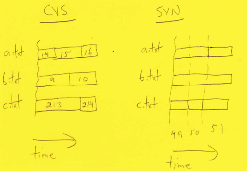

A couple of cubicles away, Wolfman also runs `svn checkout` to get a
working copy of the repository. He also gets version 6, so the files on
his machine are the same as the files on Dracula's. While he is looking
through the files, Dracula decides to add some information to the
repository about Jupiter's moons. Using his favorite editor, he creates
a file in the `jupiter` directory called `moons.txt`, and fills it with
information about Io, Europa, Ganymede, and Callisto:

~~~~ {src="svn/moons_initial.txt"}
Name            Orbital Radius  Orbital Period  Mass            Radius
Io              421.6           1.769138        893.2           1821.6
Europa          670.9           3.551181        480.0           1560.8
Ganymede        1070.4          7.154553        1481.9          2631.2
Calisto         1882.7          16.689018       1075.9          2410.3
~~~~

After double-checking his data, he wants to commit the file to the
repository so that everyone else on the project can see it. The first
step is to add the file to his working copy using `svn add`:

    $ svn add jupiter/moons.txt
    A         jupiter/moons.txt

Adding a file is not the same as creating it—he has already done that.
Instead, the `svn add` command tells Subversion to add the file to the
list of things it's supposed to manage. It's quite common, particularly
in programming projects, to have backup files or intermediate files in a
directory that aren't worth storing in the repository. This is why
version control requires us to explicitly tell it which files are to be
managed.

Once he has told Subversion to add the file, Dracula can go ahead and
commit his changes to the repository. He uses the `-m` flag to provide a
one-line message explaining what he's doing; if he didn't, Subversion
would open his default editor so that he could type in something longer.

    $ svn commit -m "Some basic facts about the Galilean moons of Jupiter." jupiter/moons.txt
    Adding         jupiter/moons.txt
    Transmitting file data .
    Committed revision 7.

When Dracula runs this command, Subversion establishes a connection to
the server, copies over his changes, and updates the revision number
from 6 to 7 ([Figure XXX](#f:updated_repo)). Again, this version number
applies to the *whole* repository, not just to files that have changed.

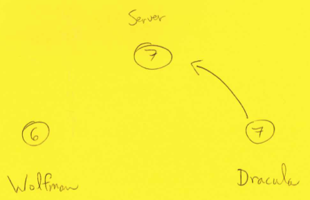

Back in his cubicle, Wolfman uses `svn update` to update his working
copy. It tells him that a new file has been added and brings his working
copy up to date with version 7 of the repository, because this is now
the most recent revision (also called the [head](glossary.html#head)).
`svn update` updates an existing working copy, rather than checking out
a new one. While `svn checkout` is usually only run once per project per
machine, `svn update` may be run many times a day.

Looking in the new file `jupiter/moons.txt`, Wolfman notices that
Dracula has misspelled "Callisto" (it is supposed to have two L's.)
Wolfman edits that line of the file:

~~~~ {src="svn/moons_spelling.txt"}
Name            Orbital Radius  Orbital Period  Mass            Radius
Io              421.6           1.769138        893.2           1821.6
Europa          670.9           3.551181        480.0           1560.8
Ganymede        1070.4          7.154553        1481.9          2631.2
Callisto        1882.7          16.689018       1075.9          2410.3
~~~~

He also adds a line about Amalthea, which he thinks might be a good site
for a secret lair despite its small size:

~~~~ {src="svn/moons_amalthea.txt"}
Name            Orbital Radius  Orbital Period  Mass            Radius
Amalthea        181.4           0.498179        0.075           125.0
Io              421.6           1.769138        893.2           1821.6
Europa          670.9           3.551181        480.0           1560.8
Ganymede        1070.4          7.154553        1481.9          2631.2
Callisto        1882.7          16.689018       1075.9          2410.3
~~~~

uses the `svn status` command to check that he hasn't accidentally
changed anything else:

    $ svn status
    M       jupiter/moons.txt

and then runs `svn commit`. Since has hasn't used the `-m` flag to
provide a message on the command line, Subversion launches his default
editor and shows him:

    --This line, and those below, will be ignored--

    M    jupiter/moons.txt

He changes this to be

    1. Fixed typo in moon's name: 'Calisto' -> 'Callisto'.
    2. Added information about Amalthea.
    --This line, and those below, will be ignored--

    M    jupiter/moons.txt

When he saves this temporary file and exits the editor, Subversion
commits his changes:

    Sending        jupiter/moons.txt
    Transmitting file data .
    Committed revision 8.

Note that since Wolfman didn't specify a particular file to commit,
Subversion commits *all* of his changes. This is why he ran the
`svn status` command first.

### Working With Multiple Files

Our example only includes one file, but version control can work on any
number of files at once. For example, if Wolfman noticed that a dozen
data files had the same incorrect header, he could change it in all 12
files, then commit all those changes at once. This is actually the best
way to work: every logical change to the project should be a single
commit, and every commit should include everything involved in one
logical change.

That night, when Dracula rises from his coffin to start work, the first
thing he wants to do is get Wolfman's changes. Before updating his
working copy with `svn update`, though, he wants to see the differences
between what he has and what he *will* have if he updates. To do this,
Dracula uses `svn diff`. When run without arguments, it compares what's
in his working copy to what he started with, and shows no differences:

    $ svn diff
    $

To compare his working copy to the master, Dracula uses
`svn diff -r HEAD`. The `-r` flag is used to specify a revision, while
`HEAD` means "[the latest version of the master](#a:define-head)".

    $ svn diff -r HEAD
    --- moons.txt(revision 8)
    +++ moons.txt(working copy)
    @@ -1,5 +1,6 @@
     Name            Orbital Radius  Orbital Period  Mass            Radius
    +Amalthea        181.4           0.498179        0.075           125.0
     Io              421.6           1.769138        893.2           1821.6
     Europa          670.9           3.551181        480.0           1560.8
     Ganymede        1070.4          7.154553        1481.9          2631.2
    -Calisto         1882.7          16.689018       1075.9          2410.3
    +Callisto        1882.7          16.689018       1075.9          2410.3

After looking over the changes, Dracula goes ahead and does the update.

### Reading a Diff

The output of `diff` isn't particularly user-friendly, but actually
isn't that hard to figure out. The first two lines:

    --- moons.txt(revision 9)
    +++ moons.txt(working copy)

signal that '-' will be used to show content from revision 9 and '+' to
show content from the user's working copy. The next line, with the '@'
markers, indicates where lines were inserted or removed. This isn't
really intended for human consumption: a variety of other software tools
will use this information.

The most important parts of what follows are the lines marked with '+'
and '-', which show insertions and deletions respectively. Here, we can
see that the line for Amalthea was inserted, and that the line for
Callisto was changed (which is indicated by an add and a delete right
next to one another). Many editors and other tools can display diffs
like this in a two-column display, highlighting changes.

This is a very common workflow, and is the basic heartbeat of most
developers' days. To recap, the steps are:

1.  Check to see if there are changes in the repository to download.
2.  Update our working copy with those changes.
3.  Do our own work.
4.  Commit our changes to the repository so that other people can get
    them.

It's worth noticing here how important Wolfman's comments about his
changes were. It's hard to see the difference between "Calisto" with one
'L' and "Callisto" with two, even if the line containing the difference
has been highlighted. Without Wolfman's comments, Dracula might have
wasted time wondering what the difference was.

In fact, Wolfman should probably have committed his two changes
separately, since there's no logical connection between fixing a typo in
Callisto's name and adding information about Amalthea to the same file.
Just as a function or program should do one job and one job only, a
single commit to version control should have a single logical purpose so
that it's easier to find, understand, and if necessary undo later on.

### Summary

-   Version control is a better way to manage shared files than email or
    shared folders.
-   The master copy is stored in a repository.
-   Nobody ever edits the master directory: instead, each person edits a
    local working copy.
-   People share changes by committing them to the master or updating
    their local copy from the master.
-   The version control system prevents people from overwriting each
    other's work by forcing them to merge concurrent changes before
    committing.
-   It also keeps a complete history of changes made to the master so
    that old versions can be recovered reliably.
-   Version control systems work best with text files, but can also
    handle binary files such as images and Word documents.
-   Every repository is identified by a URL.
-   Working copies of different repositories may not overlap.
-   Each changed to the master copy is identified by a unique revision
    number.
-   Revisions identify snapshots of the entire repository, not changes
    to individual files.
-   Each change should be commented to make the history more readable.
-   Commits are transactions: either all changes are successfully
    committed, or none are.
-   The basic workflow for version control is update-change-commit.
-   `svn add things` tells Subversion to start managing particular files
    or directories.
-   `svn checkout url` checks out a working copy of a repository.
-   `svn commit -m "message" things` sends changes to the repository.
-   `svn diff` compares the current state of a working copy to the state
    after the most recent update.
-   `svn diff -r HEAD` compares the current state of a working copy to
    the state of the master copy.
-   `svn history` shows the history of a working copy.
-   `svn status` shows the status of a working copy.
-   `svn update` updates a working copy from the repository.

Merging Conflicts
-----------------

### Understand:

-   What a conflict in an update is.
-   How to resolve conflicts when updating.

Dracula and Wolfman have both synchronized their working copies of
`monsters` with version 8 of the repository. Dracula now edits his copy
to change Amalthea's radius from a single number to a triple to reflect
its irregular shape:

~~~~ {src="svn/moons_dracula_triple.txt"}
Name            Orbital Radius  Orbital Period  Mass            Radius
Amalthea        181.4           0.498179        0.075           131 x 73 x 67
Io              421.6           1.769138        893.2           1821.6
Europa          670.9           3.551181        480.0           1560.8
Ganymede        1070.4          7.154553        1481.9          2631.2
Callisto        1882.7          16.689018       1075.9          2410.3
~~~~

He then commits his work, creating revision 9 of the repository ([Figure
XXX](#f:after_dracula_commits)).

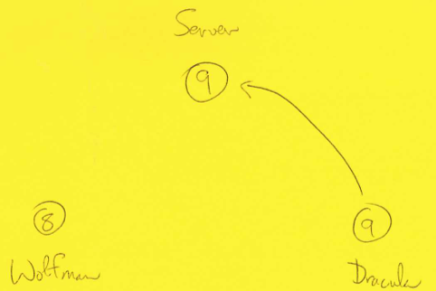

But while he is doing this, Wolfman is editing *his* copy to add
information about two other minor moons, Himalia and Elara:

~~~~ {src="svn/moons_wolfman_extras.txt"}
Name            Orbital Radius  Orbital Period  Mass            Radius
Amalthea        181.4           0.498179        0.075           131
Io              421.6           1.769138        893.2           1821.6
Europa          670.9           3.551181        480.0           1560.8
Ganymede        1070.4          7.154553        1481.9          2631.2
Callisto        1882.7          16.689018       1075.9          2410.3
Himalia         11460           250.5662        0.095           85.0
Elara           11740           259.6528        0.008           40.0
~~~~

When Wolfman tries to commit his changes to the repository, Subversion
won't let him:

    $ svn commit -m "Added data for Himalia, Elara"
    Sending        jupiter/moons.txt
    svn: Commit failed (details follow):
    svn: File or directory 'moons.txt' is out of date; try updating
    svn: resource out of date; try updating

The reason is that Wolfman's changes were based on revision 8, but the
repository is now at revision 9, and the file that Wolfman is trying to
overwrite is different in the later revision. (Remember, one of version
control's main jobs is to make sure that people don't trample on each
other's work.) Wolfman has to update his working copy to get Dracula's
changes before he can commit. Luckily, Dracula edited a line that
Wolfman didn't change, so Subversion can merge the differences
automatically.

This does *not* mean that Wolfman's changes have been committed to the
repository: Subversion only does that when it's ordered to. Wolfman's
changes are still in his working copy, and *only* in his working copy.
But since Wolfman's version of the file now includes the lines that
Dracula added, Wolfman can go ahead and commit them as usual to create
revision 10.

Wolfman's working copy is now in sync with the master, but Dracula's is
one behind at revision 9. At this point, they independently decide to
add measurement units to the columns in `moons.txt`. Wolfman is quicker
off the mark this time; he adds a line to the file:

~~~~ {src="svn/moons_wolfman_units.txt"}
Name            Orbital Radius  Orbital Period  Mass            Radius
                (10**3 km)      (days)          (10**20 kg)     (km)
Amalthea        181.4           0.498179        0.075           131 x 73 x 67
Io              421.6           1.769138        893.2           1821.6
Europa          670.9           3.551181        480.0           1560.8
Ganymede        1070.4          7.154553        1481.9          2631.2
Callisto        1882.7          16.689018       1075.9          2410.3
Himalia         11460           250.5662        0.095           85.0
Elara           11740           259.6528        0.008           40.0
~~~~

and commits it to create revision 11. While he is doing this, though,
Dracula inserts a different line at the top of the file:

~~~~ {src="svn/moons_dracula_units.txt"}
Name            Orbital Radius  Orbital Period  Mass            Radius
                * 10^3 km       * days          * 10^20 kg      * km
Amalthea        181.4           0.498179        0.075           131 x 73 x 67
Io              421.6           1.769138        893.2           1821.6
Europa          670.9           3.551181        480.0           1560.8
Ganymede        1070.4          7.154553        1481.9          2631.2
Callisto        1882.7          16.689018       1075.9          2410.3
Himalia         11460           250.5662        0.095           85.0
Elara           11740           259.6528        0.008           40.0
~~~~

Once again, when Dracula tries to commit, Subversion tells him he can't.
But this time, when Dracula does updates his working copy, he doesn't
just get the line Wolfman added to create revision 11. There is an
actual conflict in the file, so Subversion asks Dracula what he wants to
do:

~~~~ {src="svn/moons_dracula_conflict.txt"}
$ svn update
Conflict discovered in 'jupiter/moons.txt'.
Select: (p) postpone, (df) diff-full, (e) edit,
        (mc) mine-conflict, (tc) theirs-conflict,
        (s) show all options:
~~~~

Dracula choose `p` for "postpone", which tells Subversion that he'll
deal with the problem later. Once the update is finished, he opens
`moons.txt` in his editor and sees:

     Name            Orbital Radius  Orbital Period  Mass
    +<<<<<<< .mine
             +                * 10^3 km       * days         * 10^20 kg
    +=======
    +                (10**3 km)      (days)         (10**20 kg)
    +>>>>>>> .r11
     Amalthea        181.4           0.498179        0.074
     Io              421.6           1.769138        893.2
     Europa          670.9           3.551181        480.0
     Ganymede        1070.4          7.154553        1481.9
     Callisto        1882.7          16.689018       1075.9

As we can see, Subversion has inserted [conflict
markers](glossary.html#conflict-marker) in `moons.txt` wherever there is
a conflict. The line `<<<<<<< .mine` shows the start of the conflict,
and is followed by the lines from the local copy of the file. The
separator `=======` is then followed by the lines from the repository's
file that are in conflict with that section, while `>>>>>>> .r11` marks
the end of the conflict.

Before he can commit, Dracula has to edit his copy of the file to get
rid of those markers. He changes it to:

~~~~ {src="svn/moons_dracula_resolved.txt"}
Name            Orbital Radius  Orbital Period  Mass            Radius
                (10^3 km)       (days)          (10^20 kg)      (km)
Amalthea        181.4           0.498179        0.075           131 x 73 x 67
Io              421.6           1.769138        893.2           1821.6
Europa          670.9           3.551181        480.0           1560.8
Ganymede        1070.4          7.154553        1481.9          2631.2
Callisto        1882.7          16.689018       1075.9          2410.3
Himalia         11460           250.5662        0.095           85.0
Elara           11740           259.6528        0.008           40.0
~~~~

then uses the `svn resolved` command to tell Subversion that he has
fixed the problem. Subversion will now let him commit to create revision
12.

### Auxiliary Files

When Dracula did his update and Subversion detected the conflict in
`moons.txt`, it created three temporary files to help Dracula resolve
it. The first is called `moons.txt.r9`; it is the file as it was in
Dracula's local copy before he started making changes, i.e., the common
ancestor for his work and whatever he is in conflict with.

The second file is `moons.txt.r11`. This is the most up-to-date revision
from the repository—the file as it is including Wolfman's changes. The
third temporary file, `moons.txt.mine`, is the file as it was in
Dracula's working copy before he did the Subversion update.

Subversion creates these auxiliary files primarily to help people merge
conflicts in binary files. It wouldn't make sense to insert `<<<<<<<`
and `>>>>>>>` characters into an image file (it would almost certainly
result in a corrupted image). The `svn resolved` command deletes these
three extra files as well as telling Subversion that the conflict has
been taken care of.

Some power users prefer to work with interpolated conflict markers
directly, but for the rest of us, there are several tools for displaying
differences and helping to merge them, including
[Diffuse](http://diffuse.sourceforge.net/) and
[WinMerge](http://winmerge.org/). If Dracula launches Diffuse, it
displays his file, the common base that he and Wolfman were working
from, and Wolfman's file in a three-pane view ([Figure
XXX](#f:diff_viewer)):

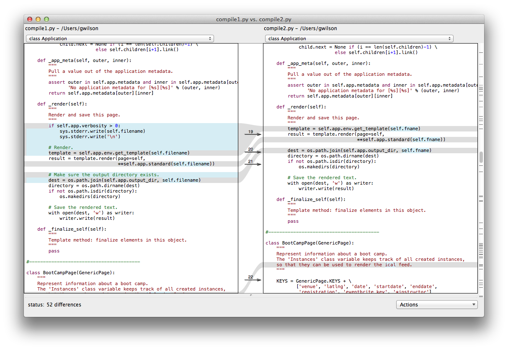

Dracula can use the buttons to merge changes from either of the edited
versions into the common ancestor, or edit the central pane directly.
Again, once he is done, he uses `svn resolved` and `svn commit` to
create revision 12 of the repository.

In this case, the conflict was small and easy to fix. However, if two or
more people on a team are repeatedly creating conflicts for one another,
it's usually a signal of deeper communication problems: either they
aren't talking as often as they should, or their responsibilities
overlap. If used properly, the version control system can help the team
find and fix these issues so that it will be more productive in future.

### Working With Multiple Files

As mentioned [earlier](#a:transaction), every logical change to a
project should result in a single commit, and every commit should
represent one logical change. This is especially true when resolving
conflicts: the work done to reconcile one person's changes with another
are often complicated, so it should be a single entry in the project's
history, with other, later, changes coming after it.

### Summary

-   Conflicts must be resolved before a commit can be completed.
-   Subversion puts markers in text files to show regions of conflict.
-   For each conflicted file, Subversion creates auxiliary files
    containing the common parent, the master version, and the local
    version.
-   `svn resolve files` tells Subversion that conflicts have been
    resolved.

Recovering Old Versions
-----------------------

### Understand:

-   How to undo changes to a working copy.
-   How to recover old versions of files.
-   What a branch is.

Now that we have seen how to merge files and resolve conflicts, we can
look at how to use version control as an "infinite undo". Suppose that
when Wolfman starts work late one night, his copy of `monsters` is in
sync with the head at revision 12. He decides to edit the file
`moons.txt`; unfortunately, he forgot that there was a full moon, so his
changes don't make a lot of sense:

~~~~ {src="svn/poetry.txt"}
Just one moon can make me growl
Four would make me want to howl
...
~~~~

When he's back in human form the next day, he wants to undo his changes.
Without version control, his choices would be grim: he could try to edit
them back into their original state by hand (which for some reason
hardly ever seems to work), or ask his colleagues to send him their
copies of the files (which is almost as embarrassing as chasing the
neighbor's cat when in wolf form).

Since he's using Subversion, though, and hasn't committed his work to
the repository, all he has to do is [revert](glossary.html#revert) his
local changes. `svn revert` simply throws away local changes to files
and puts things back the way they were before those changes were made.
This is a purely local operation: since Subversion stores the history of
the project inside every working copy, Wolfman doesn't need to be
connected to the network to do this.

To start, Wolfman uses `svn diff` *without* the `-r HEAD` flag to take a
look at the differences between his file and the master copy in the
repository. Since he doesn't want to keep his changes, his next command
is `svn revert moons.txt`.

    $ cd jupiter
    $ svn revert moons.txt
    Reverted   moons.txt

What if someone *has* committed their changes, but still wants to undo
them? For example, suppose Dracula decides that the numbers in
`moons.txt` would look better with commas. He edits the file to put them
in:

~~~~ {src="svn/moons_commas.txt"}
Name            Orbital Radius  Orbital Period  Mass            Radius
                (10^3 km)       (days)          (10^20 kg)      (km)
Amalthea        181.4           0.498179          0.075      131 x 73 x 67
Io              421.6           1.769138        893.2          1,821.6
Europa          670.9           3.551181        480.0          1,560.8
Ganymede      1,070.4           7.154553      1,481.9          2,631.2
Callisto      1,882.7          16.689018      1,075.9          2,410.3
Himalia      11,460           250.5662            0.095           85.0
Elara        11,740           259.6528            0.008           40.0
~~~~

then commits his changes to create revision 13. A little while later,
the Mummy sees the change and orders Dracula to put things back the way
they were. What should Dracula do?

We can draw the sequence of events leading up to revision 13 as shown in
[Fixture XXX](#f:before_undoing):

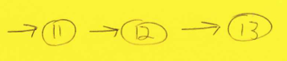

Dracula wants to erase revision 13 from the repository, but he can't
actually do that: once a change is in the repository, it's there
forever. What he can do instead is merge the old revision with the
current revision to create a new revision ([Fixture
XXX](#f:merging_history)).

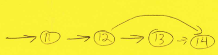

This is exactly like merging changes made by two different people; the
only difference is that the "other person" is his past self.

To undo his commas, Dracula must merge revision 12 (the one before his
change) with revision 13 (the current head revision) using `svn merge`:

    $ svn merge -r HEAD:12 moons.txt
    -- Reverse-merging r13 into 'moons.txt'
    U  moons.txt

The `-r` flag specifies the range of revisions to merge: to undo the
changes from revision 12 to revision 13, he uses either `13:12` or
`HEAD:12` (since he is going backward in time from the most recent
revision to revision 12). This is called a
[reverse](glossary.html#reverse-merge) merge because he's going backward
in time.

After he runs this command, he must run `svn commit` to save the changes
to the repository. This creates a new revision, number 14, rather than
erasing revision 13. That way, the changes he made to create revision 13
are still there if he can ever convince the Mummy that numbers should
have commas.

Merging can be used to recover older revisions of files, not just the
most recent, and to recover many files or directories at a time. The
most frequent use, though, is to manage parallel streams of development
in large projects. This is outside the scope of this chapter, but the
basic idea is simple.

Suppose that Universal Monsters has just released a new program for
designing secret lairs. Dracula and Wolfman are supposed to start adding
a few features that had to be left out of the first release because time
ran short. At the same time, Frankenstein and the Mummy are doing
technical support: their job is to fix any bugs that users find. All
sorts of things could go wrong if both teams tried to work on the same
code at the same time. For example, if Frankenstein fixed a bug and sent
a new copy of the program to a user in Greenland, it would be all too
easy for him to accidentally include the half-completed shark tank
control feature that Wolfman was working on.

The usual way to handle this situation is to create a
[branch](glossary.html#branch) in the repository for each major
sub-project ([Figure XXX](#f:branch_merge)). While Wolfman and Dracula
work on the [main line](glossary.html#main-line), Frankenstein and the
Mummy create a branch, which is just another copy of the repository's
files and directories that is also under version control. They can work
in their branch without disturbing Wolfman and Dracula and vice versa:

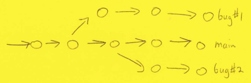

Branches in version control repositories are often described as
"parallel universes". Each branch starts off as a clone of the project
at some moment in time (typically each time the software is released, or
whenever work starts on a major new feature). Changes made to a branch
only affect that branch, just as changes made to the files in one
directory don't affect files in other directories. However, the branch
and the main line are both stored in the same repository, so their
revision numbers are always in step.

If someone decides that a bug fix in one branch should also be made in
another, all they have to do is merge the files in question. This is
exactly like merging an old version of a file with the current one, but
instead of going backward in time, the change is brought sideways from
one branch to another.

Branching helps projects scale up by letting sub-teams work
independently, but too many branches can cause as many problems as they
solve. Karl Fogel's excellent book [Producing Open Source
Software](bib.html#fogel-producing-oss), and Laura Wingerd and
Christopher Seiwald's paper "[High-level Best Practices in Software
Configuration Management](bib.html#wingerd-seiwald-scm)", talk about
branches in much more detail. Projects usually don't need to do this
until they have a dozen or more developers, or until several versions of
their software are in simultaneous use, but using branches is a key part
of switching from software carpentry to software engineering.

### Summary

-   Old versions of files can be recovered by merging their old state
    with their current state.
-   Recovering an old version of a file does not erase the intervening
    changes.
-   Use branches to support parallel independent development.
-   `svn merge` merges two revisions of a file.
-   `svn revert` undoes local changes to files.

Setting up a Repository
-----------------------

### Understand:

-   How to create a repository.

It is finally time to see how to create a repository. As a quick recap,
we will keep the master copy of our work in a repository on a server
that we can access from other machines on the internet. That master copy
consists of files and directories that no-one ever edits directly.
Instead, a copy of Subversion running on that machine manages updates
for us and watches for conflicts. Our working copy is a mirror image of
the master sitting on our computer. When our Subversion client needs to
communicate with the master, it exchanges data with the copy of
Subversion running on the server.

To make this to work, we need four things ([Figure
XXX](#f:repo_four_things)):

1.  The repository itself. It's not enough to create an empty directory
    and start filling it with files: Subversion needs to create a lot of
    other structure in order to keep track of old revisions, who made
    what changes, and so on.
2.  The full URL of the repository. This includes the URL of the server
    and the path to the repository on that machine. (The second part is
    needed because a single server can, and usually will, host many
    repositories.)
3.  Permission to read or write the master copy. Many open source
    projects give the whole world permission to read from their
    repository, but very few allow strangers to write to it: there are
    just too many possibilities for abuse. Somehow, we have to set up a
    password or something like it so that users can prove who they are.
4.  A working copy of the repository on our computer. Once the first
    three things are in place, this just means running the `checkout`
    command.

To keep things simple, we will start by creating a repository on the
machine that we're working on. This won't let us share our work with
other people, but it *will* allow us to save the history of our work as
we go along.

The command to create a repository is `svnadmin create`, followed by the
path to the repository. If we want to create a repository called
`lair_repo` directly under our home directory, we just `cd` to get home
and run `svnadmin create lair_repo`. This command creates a directory
called `lair_repo` to hold our repository, and fills it with various
files that Subversion uses to keep track of the project's history:

    $ cd
    $ svnadmin create lair_repo
    $ ls -F lair_repo
    README.txt    conf/    db/    format    hooks/    locks/

We should *never* edit anything in this repository directly. Doing so
probably won't shred our sanity and leave us gibbering in mindless
horror, but it will almost certainly make the repository unusable.

To get a working copy of this repository, we use Subversion's `checkout`
command. If our home directory is `/users/mummy`, then the full path to
the repository we just created is `/users/mummy/lair_repo`, so we run
`svn checkout file:///users/mummy/lair lair_working`.

Working backward, the second argument, `lair_working`, specifies where
the working copy is to be put. The first argument is the URL of our
repository, and it has two parts. `/users/mummy/lair_repo` is the path
to repository directory. `file://` specifies the
[protocol](glossary.html#protocol) that Subversion will use to
communicate with the repository—in this case, it says that the
repository is part of the local machine's filesystem. Notice that the
protocol ends in two slashes, while the absolute path to the repository
starts with a slash, making three in total. A very common mistake is to
type only two, since that's what web URLs normally have.

When we're doing a checkout, it is *very* important that we provide the
second argument, which specifies the name of the directory we want the
working copy to be put in. Without it, Subversion will try to use the
name of the repository, `lair_repo`, as the name of the working copy.
Since we're in the directory that contains the repository, this means
that Subversion will try to overwrite the repository with a working
copy. Again, there isn't much risk of our sanity being torn to shreds,
but this could ruin our repository.

To avoid this problem, most people create a sub-directory in their
account called something like `repos`, and then create their
repositories in that. For example, we could create our repository in
`/users/mummy/repos/lair`, then check out a working copy as
`/users/mummy/lair`. This practice makes both names easier to read.

The obvious next steps are to put our repository on a server, rather
than on our personal machine, and to give other people access to the
repository we have just created so that they can work with us. We'll
discuss the first in [a later chapter](web.html#s:svn), but
unfortunately, the second really does require things that we are not
going to cover in this course. If you want to do this, you can:

-   ask your system administrator to set it up for you;
-   use an open source hosting service like
    [SourceForge](http://www.sf.net), [Google
    Code](http://code.google.com), [GitHub](https://github.com/), or
    [BitBucket](https://bitbucket.org/); or
-   spend a few dollars a month on a commercial hosting service like
    [DreamHost](http://dreamhost.com) that provides web-based GUIs for
    creating and managing repositories.

If you choose the second or third option, please check with whoever
handles intellectual property at your institution to make sure that
putting your work on a commercially-operated machine that is probably in
some other legal jurisdiction isn't going to cause trouble. Many people
assume that it's "just OK", while others act as if not having asked will
be an acceptable defence later on. Unfortunately, neither is true…

### Summary

-   Repositories can be hosted locally, on local (departmental) servers,
    on hosting services, or on their owners' own domains.
-   `svnadmin create name` creates a new repository.

Provenance
----------

### Understand:

-   What data provenance is.
-   How to embed version numbers and other information in files managed
    by version control.
-   How to record version information about a program in its output.

In art, the [provenance](glossary.html#provenance) of a work is the
history of who owned it, when, and where. In science, it's the record of
how a particular result came to be: what raw data was processed by what
version of what program to create which intermediate files, what was
used to turn those files into which figures of which papers, and so on.

One of the central ideas of this course is that wen can automatically
track the provenance of scientific data. To start, suppose we have a
text file `combustion.dat` in a Subversion repository. Run the following
two commands:

    $ svn propset svn:keywords Revision combustion.dat
    $ svn commit -m "Turning on the 'Revision' keyword" combustion.dat

Now open the file in an editor and add the following line somewhere near
the top:

    # $Revision:$

The '\#' sign isn't important: it's just what `.dat` files use to show
comments. The `$Revision:$` string, on the other hand, means something
special to Subversion. Save the file, and commit the change:

    $ svn commit -m "Inserting the 'Revision' keyword" combustion.dat

When we open the file again, we'll see that Subversion has changed that
line to something like:

    # $Revision: 143$

i.e., Subversion has inserted the version number after the colon and
before the closing `$`.

Here's what just happened. First, Subversion allows you to set
[properties](glossary.html#property-subversion) for files and and
directories. These properties aren't in the files or directories
themselves, but live in Subversion's database. One of those properties,
`svn:keywords`, tells Subversion to look in files that are being changed
for strings of the form `$propertyname: …$`, where `propertyname` is a
string like `Revision` or `Author`. (About half a dozen such strings are
supported.)

If it sees such a string, Subversion rewrites it as the commit is taking
place to replace `…` with the current version number, the name of the
person making the change, or whatever else the property's name tells it
to do. You only have to add the string to the file once; after that,
Subversion updates it for you every time the file changes.

Putting the version number in the file this way can be pretty handy. If
you copy the file to another machine, for example, it carries its
version number with it, so you can tell which version you have even if
it's outside version control. We'll see some more useful things we can
do with this information in [the next chapter](python.html).

### When *Not* to Use Version Control

Despite the rapidly decreasing cost of storage, it is still possible to
run out of disk space. In some labs, people can easy go through 2
TB/month if they're not careful. Since version control tools usually
store revisions in terms of lines, with binary data files, they end up
essentially storing every revision separately. This isn't that bad (it's
what we'd be doing anyway), but it means version control isn't doing
what it likes to do, and the repository can get very large very quickly.
Another concern is that if very old data will no longer be used, it can
be nice to archive or delete old data files. This is not possible if our
data is version controlled: information can only be added to a
repository, so it can only ever increase in size.

We can use this trick with shell scripts too, or with almost any other
kind of program. Going back to Nelle Nemo's data processing from the
previous chapter, for example, suppose she writes a shell script that
uses `gooclean` to tidy up data files. Her first version looks like
this:

    for filename in $*
    do
        gooclean -b 0 100 < $filename > cleaned-$filename
    done

i.e., it runs `gooclean` with bounding values of 0 and 100 for each
specified file, putting the result in a temporary file with a
well-defined name. Assuming that '\#' is the comment character for those
kinds of data files, she could instead write:

    for filename in $*
    do
        echo "gooclean $Revision: 901$ -b 0 100" > $filename
        gooclean -b 0 100 < $filename >> cleaned-$filename
    done

The first change puts a line in the output file that describes how that
file was created. The second change is to use `>>` instead of `>` to
redirect `gooclean`'s output to the file. `>>` means "append to":
instead of overwriting whatever is in the file, it adds more content to
it. This ensures that the first line of the file is the provenance
record, with the actual output of `gooclean` after it.

### Summary

-   `$Keyword:$` in a file can be filled in with a property value each
    time the file is committed.
-   Put version numbers in programs' output to establish provenance for
    data.
-   `svn propset svn:keywords property files` tells Subversion to start
    filling in property values.

Summing Up
----------

Correlation does not imply causality, but there is a very strong
correlation between using version control and doing good computational
science. There's an equally strong correlation between *not* using it
and wasting effort, so today (the middle of 2012), I will not review a
paper if the software used in it is not under version control. Its
authors' work might be interesting, but without the kind of
record-keeping that version control provides, there's no way to know
exactly what they did and when. Just as importantly, if someone doesn't
know enough about computing to use version control, the odds are good
that they don't know enough to do the programming right either.
